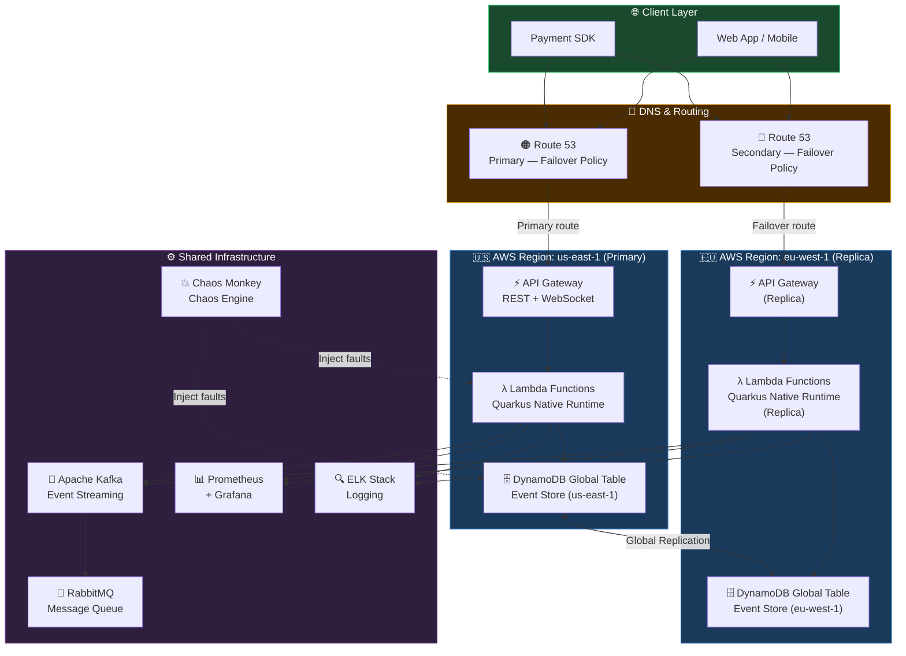
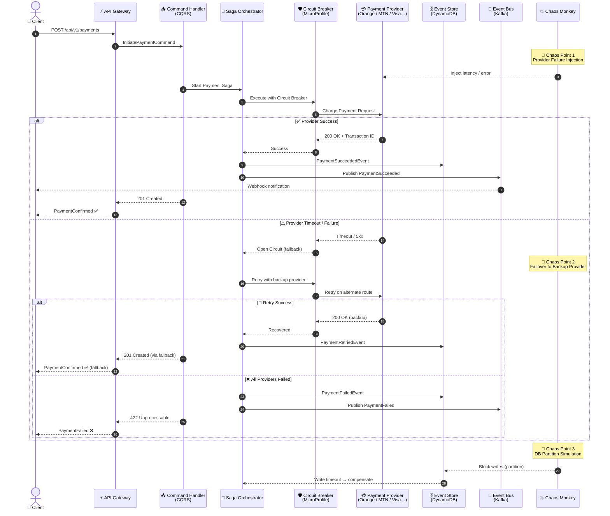
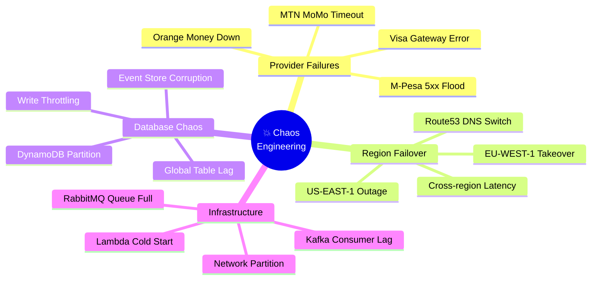

# 🔥 Payment Chaos Engineering - Multi-Region Serverless

<div align="center">


</div>

> Chaos Engineering platform for a multi-region serverless payment aggregator  
> supporting Orange Money, Moov, MTN, Wave, Visa, Mastercard, Airtel, M-Pesa, Bitcoin, PI/SPI BCEAO

## Architecture Overview

### 🌍 Multi-Region AWS Architecture



---

### 💳 Payment Flow & Chaos Injection Points



---

### 🔥 Chaos Experiments Map



## Payment Providers Supported

| Provider      | Type          | Currencies     | Region        |
|---------------|---------------|----------------|---------------|
| Orange Money  | Mobile Money  | XOF, XAF, GNF  | West Africa   |
| Moov Money    | Mobile Money  | XOF, XAF       | West Africa   |
| MTN MoMo      | Mobile Money  | GHS, NGN, XOF  | Pan-Africa    |
| Wave          | Mobile Money  | XOF, GNF       | West Africa   |
| Airtel Money  | Mobile Money  | KES, TZS, UGX  | East Africa   |
| M-Pesa        | Mobile Money  | KES, TZS, GHS  | East Africa   |
| Visa          | Card          | USD, EUR, XOF  | International |
| Mastercard    | Card          | USD, EUR, XOF  | International |
| Bitcoin       | Crypto        | BTC, USD       | Global        |
| PI/SPI BCEAO  | Interbank     | XOF            | UEMOA Zone    |

## Architecture Patterns

- **DDD**: Domain-Driven Design with Aggregate Roots, Value Objects, Domain Events
- **CQRS**: Commands (write) separated from Queries (read)
- **Event Sourcing**: All state changes stored as events in DynamoDB
- **Event-Driven**: Kafka for event streaming, RabbitMQ for reliable messaging
- **Saga Pattern**: Distributed transactions across payment providers
- **Circuit Breaker**: MicroProfile Fault Tolerance
- **Chaos Engineering**: Netflix-style chaos monkey

## Quick Start

### Prerequisites

- Docker & Docker Compose
- Java 17+
- Maven 3.8+
- AWS CLI (for AWS deployment)
- Terraform 1.5+ (for AWS deployment)

### Local Development

```bash
# Clone repository
git clone https://github.com/org/payment-chaos-engineering.git
cd payment-chaos-engineering

# Build services
make build

# Start all services
make deploy-local

# Run tests
make test

# Start chaos mode (10% failure rate)
make chaos-start CHAOS_RATE=0.1

# Run chaos experiments
make chaos-experiment-failover
make chaos-experiment-provider PROVIDER=ORANGE

# View results
make chaos-report
open http://localhost:3000  # Grafana
```

### AWS Free Tier Deployment

```bash
# Configure AWS credentials
aws configure

# Initialize Terraform
cd infrastructure/terraform
terraform init

# Deploy (Free Tier optimized)
terraform plan -out=tfplan
terraform apply tfplan

# Outputs
terraform output payment_api_url
terraform output grafana_url
```

## Chaos Experiments

### 1. Provider Failure

Tests automatic failover when payment provider fails.

```bash
make chaos-experiment-provider PROVIDER=ORANGE
```

### 2. Region Failover

Tests Route53 health check failover to secondary region.

```bash
make chaos-experiment-failover
```

### 3. Database Partition

Tests system behavior during DynamoDB unavailability.

```bash
curl -X POST http://localhost:8080/api/v1/chaos/experiments/db-partition
```

### 4. Cascade Failure

Tests resilience when multiple providers fail simultaneously.

```bash
curl -X POST http://localhost:8080/api/v1/chaos/experiments/cascade-failure
```

## Monitoring

| Tool        | URL                                   | Credentials          |
|-------------|---------------------------------------|----------------------|
| Grafana     | http://localhost:3000                 | admin/chaos_admin    |
| Kibana      | http://localhost:5601                 | No auth required     |
| Prometheus  | http://localhost:9090                 | No auth required     |
| Kafka UI    | http://localhost:8085                 | No auth required     |
| RabbitMQ    | http://localhost:15672                | payment/payment_secret |
| Swagger UI  | http://localhost:8080/q/swagger-ui    | No auth              |
